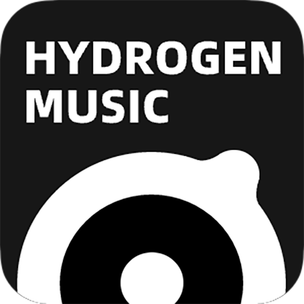

<br />
<p align="center">
  <a href="https://github.com/SherkeyXD/Hydrogen-Music" target="blank">
    
  </a>
  <h2 align="center" style="font-weight: 600">Hydrogen Music</h2>
  

## ⚠️ 注意：

- 项目原作者已经停止对仓库的维护，且出于某种原因注销了 Github 账号，本仓库目前接替维护工作
- 由于本人对 UI 设计及 electron 开发仅有一知半解，本仓库的维护以修 Bug 为主，大概率不会添加新功能

## 📢 来自原作者的话

- 本项目是为了尽快应付毕业设计的产物，没有根据软件工程规范编写，仅供参考！
- ~~本项目下半年会进行重构，届时会重写所有源代码，请在接受此条件的前提下提交PR。~~
- 由于本地管理功能并不完善，请尽量将其作为流媒体播放器使用。
- 因网易增加了网易云盾验证，密码与邮箱登录无法使用，请使用二维码登录。
- 请尽量不要使用云盘中的上传功能，目前上传失败概率大且内存无法得到释放。
- <a href="#%EF%B8%8F-安装" target="blank"><strong>📦️ 下载安装包</strong></a>

## 📦️ 安装

Windows，Linux 与 MacOS 全平台可用，但 Windows 以外的平台未经测试，可能出现问题，请前往 [Issues](https://github.com/SherkeyXD/Hydrogen-Music/issues) 反馈

访问 [Releases](https://github.com/SherkeyXD/Hydrogen-Music/releases)
页面下载安装包。

## :computer: 开发与环构建

在开发模式下运行本项目

```shell
# 安装依赖
npm install

# 运行Vue服务
npm run dev

# 运行Electron客户端
npm start
```

要打包，请直接运行

```shell
# 打包
npm run dist --arch=<arch>
# arch 可选项："ia32", "x64", "armv7l", "arm64", "universal", or "mips64el"
# 参照 https://www.electronforge.io/cli#options-3
```

需要注意的是，不加参数运行默认会打包所有当前支持的平台以及架构，可能造成打包时间加长

## 📜 开源许可

本项目仅供个人学习研究使用，禁止用于商业及非法用途。

基于 [MIT license](https://opensource.org/licenses/MIT) 许可进行开源。

## 🍄 灵感来源

网易云音乐API：[Binaryify/NeteaseCloudMusicApi](https://github.com/Binaryify/NeteaseCloudMusicApi)<br />
哔哩哔哩API：[SocialSisterYi/bilibili-API-collect](https://github.com/SocialSisterYi/bilibili-API-collect)

- [qier222/YesPlayMusic](https://github.com/qier222/YesPlayMusic)
- [Apple Music](https://music.apple.com)
- [网易云音乐](https://music.163.com)

## 🖼️ 截图

![lyric2][lyric2-screenshot]
![home][home-screenshot]
![playlist][playlist-screenshot]
![lyric1][lyric1-screenshot]
![music_video][music_video-screenshot]

[lyric2-screenshot]: img/lyric2.png
[home-screenshot]: img/home.png
[playlist-screenshot]: img/playlist.png
[lyric1-screenshot]: img/lyric1.png
[music_video-screenshot]: img/music_video.png
